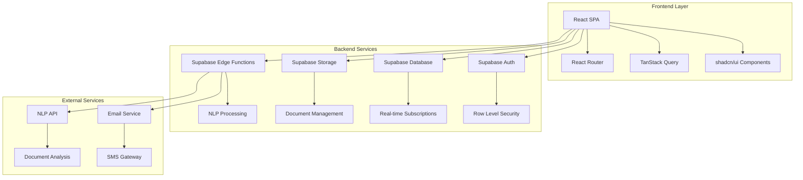
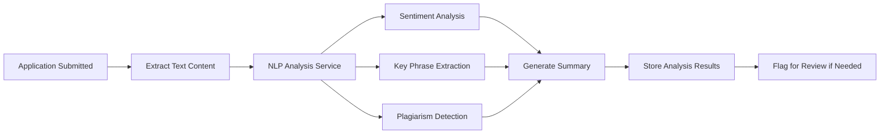
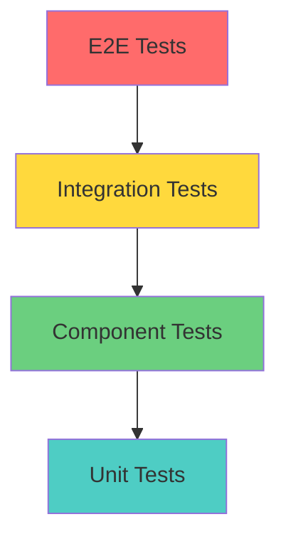

# Design Document - Online Admissions Management System

## Overview

The Online Admissions Management System is a comprehensive web application built on React/TypeScript with Supabase backend, designed specifically for the Zambian education system. The system facilitates online application submission, real-time status tracking, NLP-powered application analysis, and administrative management of school admissions across government, private, and trust/grant aided institutions.

The system leverages the existing tech stack including React 18, TypeScript, Vite, Supabase, shadcn/ui components, TanStack Query, and Tailwind CSS to provide a modern, responsive, and accessible user experience.

## Architecture

### High-Level Architecture



### System Components

1. **Frontend Application**: React SPA with TypeScript
2. **Authentication Layer**: Supabase Auth with role-based access
3. **Database Layer**: PostgreSQL via Supabase with RLS
4. **File Storage**: Supabase Storage for documents
5. **Real-time Layer**: Supabase real-time subscriptions
6. **Processing Layer**: Supabase Edge Functions for NLP and notifications
7. **Communication Layer**: Email/SMS integration

## Components and Interfaces

### User Roles and Access Levels

```typescript
enum UserRole {
  APPLICANT = 'applicant',
  PARENT = 'parent', 
  ADMISSIONS_OFFICER = 'admissions_officer',
  SCHOOL_ADMIN = 'school_admin',
  SYSTEM_ADMIN = 'system_admin'
}

interface UserProfile {
  id: string;
  email: string;
  role: UserRole;
  firstName: string;
  lastName: string;
  phoneNumber?: string;
  province?: Province;
  createdAt: Date;
  updatedAt: Date;
}
```

### Core Application Components

#### 1. Application Management
- **ApplicationForm**: Multi-step form with validation
- **DocumentUpload**: Drag-and-drop file upload with preview
- **ApplicationStatus**: Real-time status tracking with progress indicators
- **ApplicationReview**: Admin interface for reviewing applications

#### 2. School Management
- **SchoolSearch**: Advanced filtering by province and school type
- **SchoolProfile**: Detailed school information display
- **PlaceManagement**: Admin interface for managing available places
- **GradeConfiguration**: Setup for grade levels and capacity

#### 3. User Management
- **AuthenticationFlow**: Login/registration with role detection
- **ParentPortal**: Dashboard for parents to track applications
- **AdminDashboard**: Comprehensive admin interface
- **UserProfile**: Profile management and settings

#### 4. Communication System
- **NotificationCenter**: In-app notifications
- **EmailTemplates**: Automated email generation
- **MessageCenter**: Direct messaging between users

### Database Schema Design

#### Core Tables

```sql
-- Schools table
CREATE TABLE schools (
  id UUID PRIMARY KEY DEFAULT gen_random_uuid(),
  name VARCHAR NOT NULL,
  type school_type NOT NULL, -- government, private, trust_grant_aided
  province province_enum NOT NULL,
  district VARCHAR NOT NULL,
  address TEXT,
  contact_email VARCHAR,
  contact_phone VARCHAR,
  principal_name VARCHAR,
  established_year INTEGER,
  created_at TIMESTAMP DEFAULT NOW(),
  updated_at TIMESTAMP DEFAULT NOW()
);

-- Available places table
CREATE TABLE available_places (
  id UUID PRIMARY KEY DEFAULT gen_random_uuid(),
  school_id UUID REFERENCES schools(id),
  grade_level grade_enum NOT NULL, -- grade_1 to grade_12, form_1 to form_5
  total_places INTEGER NOT NULL,
  available_places INTEGER NOT NULL,
  academic_year VARCHAR NOT NULL,
  application_deadline DATE,
  created_at TIMESTAMP DEFAULT NOW(),
  updated_at TIMESTAMP DEFAULT NOW()
);

-- Applications table
CREATE TABLE applications (
  id UUID PRIMARY KEY DEFAULT gen_random_uuid(),
  applicant_id UUID REFERENCES auth.users(id),
  school_id UUID REFERENCES schools(id),
  grade_level grade_enum NOT NULL,
  status application_status DEFAULT 'draft',
  application_data JSONB NOT NULL,
  submitted_at TIMESTAMP,
  reviewed_at TIMESTAMP,
  decision_at TIMESTAMP,
  decision_reason TEXT,
  nlp_analysis JSONB,
  created_at TIMESTAMP DEFAULT NOW(),
  updated_at TIMESTAMP DEFAULT NOW()
);

-- Application documents table
CREATE TABLE application_documents (
  id UUID PRIMARY KEY DEFAULT gen_random_uuid(),
  application_id UUID REFERENCES applications(id),
  document_type document_type_enum NOT NULL,
  file_path VARCHAR NOT NULL,
  file_name VARCHAR NOT NULL,
  file_size INTEGER,
  uploaded_at TIMESTAMP DEFAULT NOW(),
  verified_at TIMESTAMP,
  verified_by UUID REFERENCES auth.users(id)
);
```

#### Enums and Types

```sql
CREATE TYPE school_type AS ENUM ('government', 'private', 'trust_grant_aided');
CREATE TYPE province_enum AS ENUM (
  'central', 'copperbelt', 'eastern', 'luapula', 'lusaka', 
  'muchinga', 'northern', 'north_western', 'southern', 'western'
);
CREATE TYPE grade_enum AS ENUM (
  'grade_1', 'grade_2', 'grade_3', 'grade_4', 'grade_5', 'grade_6', 'grade_7',
  'grade_8', 'grade_9', 'grade_10', 'grade_11', 'grade_12',
  'form_1', 'form_2', 'form_3', 'form_4', 'form_5'
);
CREATE TYPE application_status AS ENUM (
  'draft', 'submitted', 'under_review', 'documents_required', 
  'interview_scheduled', 'approved', 'rejected', 'waitlisted'
);
```

### NLP Integration Architecture

#### NLP Processing Pipeline



#### NLP Service Interface

```typescript
interface NLPAnalysisResult {
  sentiment: {
    score: number; // -1 to 1
    confidence: number;
    label: 'positive' | 'neutral' | 'negative';
  };
  keyPhrases: string[];
  summary: string;
  plagiarismScore: number;
  redFlags: string[];
  qualityScore: number;
  readabilityScore: number;
}

interface NLPService {
  analyzeApplication(content: string): Promise<NLPAnalysisResult>;
  detectSimilarity(content: string, existingApplications: string[]): Promise<number>;
  generateSummary(content: string): Promise<string>;
  extractKeyInsights(applications: Application[]): Promise<InsightReport>;
}
```

## Data Models

### Application Data Model

```typescript
interface Application {
  id: string;
  applicantId: string;
  schoolId: string;
  gradeLevel: GradeLevel;
  status: ApplicationStatus;
  applicationData: {
    personalInfo: PersonalInfo;
    academicHistory: AcademicRecord[];
    essays: Essay[];
    extracurriculars: Activity[];
    references: Reference[];
  };
  documents: ApplicationDocument[];
  nlpAnalysis?: NLPAnalysisResult;
  timeline: StatusUpdate[];
  submittedAt?: Date;
  reviewedAt?: Date;
  decisionAt?: Date;
  decisionReason?: string;
}

interface PersonalInfo {
  firstName: string;
  lastName: string;
  dateOfBirth: Date;
  gender: 'male' | 'female';
  nationality: string;
  province: Province;
  district: string;
  address: string;
  parentGuardianInfo: ParentGuardianInfo;
  emergencyContact: EmergencyContact;
  medicalInfo?: MedicalInfo;
}

interface AcademicRecord {
  institution: string;
  gradeLevel: string;
  year: number;
  subjects: SubjectGrade[];
  overallGrade?: string;
  certificateNumber?: string;
}
```

### School Data Model

```typescript
interface School {
  id: string;
  name: string;
  type: SchoolType;
  province: Province;
  district: string;
  address: string;
  contactInfo: ContactInfo;
  principalName: string;
  establishedYear: number;
  facilities: Facility[];
  programs: Program[];
  admissionCriteria: AdmissionCriteria;
  fees: FeeStructure;
  availablePlaces: AvailablePlace[];
}

interface AvailablePlace {
  gradeLevel: GradeLevel;
  totalPlaces: number;
  availablePlaces: number;
  academicYear: string;
  applicationDeadline: Date;
  requirements: string[];
}
```

## Error Handling

### Error Classification

```typescript
enum ErrorType {
  VALIDATION_ERROR = 'validation_error',
  AUTHENTICATION_ERROR = 'authentication_error',
  AUTHORIZATION_ERROR = 'authorization_error',
  NETWORK_ERROR = 'network_error',
  SERVER_ERROR = 'server_error',
  FILE_UPLOAD_ERROR = 'file_upload_error',
  NLP_PROCESSING_ERROR = 'nlp_processing_error'
}

interface AppError {
  type: ErrorType;
  message: string;
  code: string;
  details?: any;
  timestamp: Date;
  userId?: string;
  context?: string;
}
```

### Error Handling Strategy

1. **Client-Side Validation**: Real-time form validation using Zod schemas
2. **Network Error Recovery**: Automatic retry with exponential backoff
3. **User-Friendly Messages**: Contextual error messages in local language
4. **Error Logging**: Comprehensive error tracking for debugging
5. **Graceful Degradation**: Fallback functionality when services are unavailable

## Testing Strategy

### Testing Pyramid



### Test Categories

#### 1. Unit Tests
- Utility functions
- Data validation schemas
- Business logic functions
- NLP processing functions

#### 2. Component Tests
- Form components with validation
- Status tracking components
- Search and filter functionality
- File upload components

#### 3. Integration Tests
- Authentication flows
- Database operations
- API endpoint testing
- Real-time subscription testing

#### 4. End-to-End Tests
- Complete application submission flow
- Admin review and decision process
- Parent notification system
- School search and selection

### Testing Tools and Framework

```typescript
// Test configuration
interface TestConfig {
  unitTests: {
    framework: 'Vitest';
    coverage: 'c8';
    threshold: 90;
  };
  componentTests: {
    framework: 'React Testing Library';
    utilities: 'Jest DOM';
  };
  e2eTests: {
    framework: 'Playwright';
    browsers: ['chromium', 'firefox', 'webkit'];
  };
  apiTests: {
    framework: 'Supertest';
    database: 'Test Supabase Instance';
  };
}
```

### Performance Testing

1. **Load Testing**: Simulate concurrent application submissions
2. **Stress Testing**: Test system limits during peak admission periods
3. **NLP Performance**: Measure analysis processing times
4. **Database Performance**: Query optimization and indexing validation
5. **File Upload Performance**: Large document handling capabilities

## Security Considerations

### Authentication and Authorization

1. **Multi-Factor Authentication**: Required for all user types
2. **Role-Based Access Control**: Granular permissions per user role
3. **Session Management**: Secure token handling with refresh rotation
4. **Password Policies**: Strong password requirements and validation

### Data Protection

1. **Encryption**: AES-256 encryption for sensitive data at rest
2. **TLS**: All communications encrypted in transit
3. **Data Anonymization**: PII protection in logs and analytics
4. **Audit Trails**: Complete logging of all data access and modifications

### Compliance

1. **Data Privacy**: GDPR-compliant data handling procedures
2. **Document Security**: Secure file storage with access controls
3. **Backup and Recovery**: Encrypted backups with retention policies
4. **Incident Response**: Defined procedures for security breaches

## Deployment and Infrastructure

### Environment Configuration

```typescript
interface EnvironmentConfig {
  development: {
    supabaseUrl: string;
    supabaseAnonKey: string;
    nlpServiceUrl: string;
    emailServiceKey: string;
    smsServiceKey: string;
  };
  staging: {
    // Similar configuration for staging
  };
  production: {
    // Production configuration with enhanced security
  };
}
```

### Monitoring and Analytics

1. **Application Performance Monitoring**: Real-time performance metrics
2. **Error Tracking**: Comprehensive error logging and alerting
3. **User Analytics**: Usage patterns and feature adoption tracking
4. **System Health**: Database performance and service availability monitoring
5. **Security Monitoring**: Suspicious activity detection and alerting